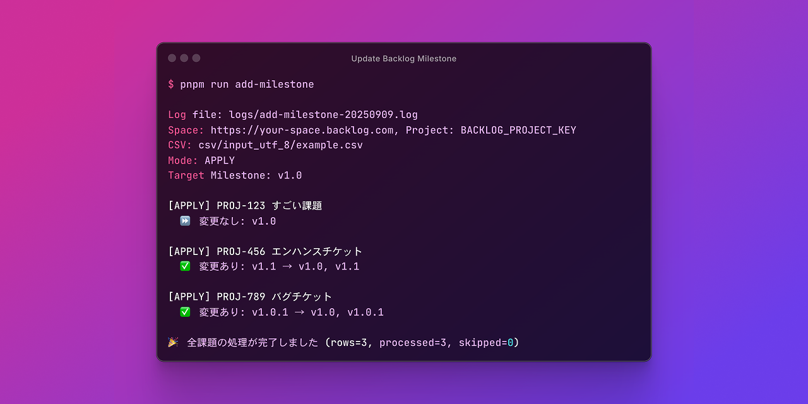

<h1 align="center">Update Backlog Milestone</h1>
<p align="center">
Backlog（ヌーラボ）のチケットを CSV と API で一括更新する
</p>

<br />

## 🤔 Why We Use the API for Bulk Updates

Backlog では GUI 上で課題のマイルストーンをまとめて追加することはできず、既存のマイルストーンは置き換えられてしまいます。
CSV 一括登録機能も新規課題の登録のみ対応しており、既存課題の更新はできません。
そのため、既存のマイルストーンを保持しつつ複数課題をまとめて更新するには、API を使う必要があります。

<br />

## 🛠️ Setup

### 前提条件

- Node.js 22.19.0 以上
- pnpm 10.15.1 以上

### インストール

```zsh
# 依存関係をインストール
pnpm install
```

### 環境変数の設定

各項目を Backlog で確認し
サンプルを元に環境変数ファイルを作成してください。

```zsh
cp .env.example .env
```

> [!NOTE]
> API キーは 個人設定 > API から取得できます。

<br />

## 🏃‍➡️ How to use

<br />

### CSV を用意

更新対象の課題キーと置換後マイルストーンが記載された CSV ファイルを用意してください。<br />
ファイルの配置ディレクトリはデフォルトで `csv/input_utf_8/` になります。

- `キー`（課題キー、例: PROJ-123）
- `マイルストーン`（カンマ区切り、例: v1.0, v1.1）

例:

```csv
キー,マイルストーン
PROJ-123,v1.0, v1.1
PROJ-456,
```

> [!NOTE]
> 課題の検索結果を CSV で出力できます。
> 詳しくは [ヘルプ](https://support-ja.backlog.com/hc/ja/articles/360035642534) を参照してください。

<br />

### マイルストーンを置換

環境変数 `CSV_FILE` で指定した CSV をソースとして、
指定課題を指定マイルストーンで上書き更新（置換）します。

```zsh
pnpm run update-milestones
```

<br />

### 任意のマイルストーンを追加

環境変数 `CSV_FILE` で指定した CSV をソースとして、
指定課題を編集し環境変数 `MILESTONE` で指定したマイルストーンを追加します。

```zsh
pnpm run add-milestone
```

<br />

### 任意のマイルストーンを削除

環境変数 `CSV_FILE` で指定した CSV をソースとして、
指定課題を編集し環境変数 `MILESTONE` で指定したマイルストーンを削除します。

```zsh
pnpm run delete-milestone
```

<br />

### マイルストーン一覧の取得（単独実行）

```zsh
pnpm run print:milestones
```

<br />

### Shift JIS → UTF-8 変換

Backlog からエクスポートした Shift JIS の CSV を UTF-8 に変換します。

```zsh
pnpm run shift-jis-to-utf8
```

- 変換元: `csv/input_shift_jis/` 配下の CSV
- 変換先: `csv/input_utf_8/` 配下に同名で出力

<br />

### ログの削除

```zsh
pnpm run logs:clear
```

<br />

### 型チェック

```zsh
pnpm run typecheck
```

<br />

### オプション

| 名前                       | 説明                                                                       | 例                                             |
| -------------------------- | -------------------------------------------------------------------------- | ---------------------------------------------- |
| `CSV_FILE`                 | 入力する CSV ファイルのパス。相対パス可                                    | `CSV_FILE=csv/input_utf_8/example.csv`         |
| `ISSUE_KEY_COLUMN`         | CSV の課題キー列のヘッダ名                                                 | `ISSUE_KEY_COLUMN=キー`                        |
| `MILESTONE_COLUMN`         | CSV のマイルストーン列のヘッダ名                                           | `MILESTONE_COLUMN=マイルストーン`              |
| `MILESTONE`                | 追加/削除の対象となるマイルストーン名（単一）                              | `MILESTONE=v1.0`                               |
| `DRY_RUN`                  | ドライラン指定（`--dry-run` と同義）                                       | `DRY_RUN=1 pnpm run add-milestone`             |
| `LOG_DIR`                  | ログの出力ディレクトリ                                                     | `LOG_DIR=logs`                                 |
| `SKIP_IF_MILESTONE_EXISTS` | いずれかの指定マイルストーンが既に付与されていたらスキップ（カンマ区切り） | `SKIP_IF_MILESTONE_EXISTS="v1.0,リリース済み"` |
| `DELAY_MS`                 | 書き込み系 API の待機時間(ms)。                                            | `DELAY_MS=1000`                                |

> [!NOTE]
>
> - 相対パスはプロジェクトルート基準。
> - パスにスペースがある場合はクオートしてください。

<br />

## ✅ ドライラン

API は呼ばず、 Before/After と差分のみ確認することができます。

```zsh
# 環境変数を使用
DRY_RUN=1 pnpm run update-milestones
DRY_RUN=1 pnpm run add-milestone
DRY_RUN=1 pnpm run delete-milestone

# 専用スクリプトを使用
pnpm run dry-run:update-milestones
pnpm run dry-run:add-milestone
pnpm run dry-run:delete-milestone
```

<br />

## 📚 Docs

- [課題をまとめて操作の使い方 – Backlog ヘルプセンター](https://support-ja.backlog.com/hc/ja/articles/360035642374)
- [課題を一括登録する – Backlog ヘルプセンター](https://support-ja.backlog.com/hc/ja/articles/46375040240025)
- [課題情報の更新 | Backlog Developer API | Nulab](https://developer.nulab.com/ja/docs/backlog/api/2/update-issue/)
- [API の設定 – Backlog ヘルプセンター](https://support-ja.backlog.com/hc/ja/articles/360035641754)
- [課題検索結果一覧の出力 – Backlog ヘルプセンター](https://support-ja.backlog.com/hc/ja/articles/360035642534)
